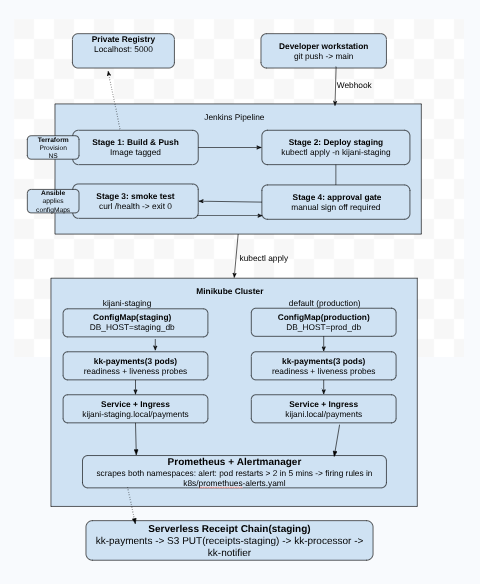

# kijani-capstone

## What is this?

KijaniKiosk processes payments at 50,000 transactions per hour. Before this project, every deployment went directly to the only running environment with no automated validation, no staging environment, and no alerting when the service degraded. This repository implements the missing layer: a staging environment provisioned by Terraform and configured by Ansible, a Jenkins pipeline that deploys to staging automatically on every merge to main, runs a smoke test, and only offers a production approval gate after the smoke test passes, environment-specific configuration separating staging from production, and Prometheus alert rules that fire when kk-payments health degrades. When the pipeline detects a smoke test failure, an AI-assisted diagnosis is printed to the Jenkins console for engineer review before any remediation decision is made.

---

## Architecture



| Component | Description |
|-----------|-------------|
| **Terraform** | Provisions the `kijani-staging` Kubernetes namespace and ResourceQuota from a clean checkout |
| **Ansible** | Applies staging-specific ConfigMaps and Secrets into the provisioned namespace |
| **Jenkins pipeline** | Five-stage pipeline: build image, push to registry, deploy to staging, smoke test, approval gate, deploy to production |
| **kijani-staging namespace** | Isolated Kubernetes namespace with its own resource quota and staging-specific configuration |
| **kk-payments (staging)** | Three-replica Deployment with readiness/liveness probes, resource limits, and configuration injected from ConfigMap and Secret |
| **Ingress controller** | Routes `kijani-staging.local/payments` to the staging kk-payments Service |
| **Prometheus + Alertmanager** | Evaluates three alert rules against kk-payments metrics in both namespaces |
| **diagnose-failure.sh** | Called by Jenkins on smoke test failure — collects diagnostics and sends to Claude API for advisory analysis |

---

## Prerequisites

| Tool | Version | Install |
|------|---------|---------|
| Docker | 24+ | https://docs.docker.com/engine/install/ |
| Minikube | 1.35+ | https://minikube.sigs.k8s.io/docs/start/ |
| kubectl | 1.35+ | https://kubernetes.io/docs/tasks/tools/ |
| Terraform | 1.0+ | https://developer.hashicorp.com/terraform/install |
| Ansible | 2.15+ | `pip install ansible` |
| Helm | 4.0+ | `sudo snap install helm --classic` |
| Node.js | 18+ | https://nodejs.org/ |
| Python | 3.10+ | Pre-installed on Ubuntu |
| ansible kubernetes.core collection | latest | `ansible-galaxy collection install kubernetes.core` |
| kubernetes Python library | latest | `pip install kubernetes --break-system-packages` |

---

## Setup

Run these commands in order from a clean checkout


**Step 1 — Start Minikube:**
```bash
minikube start 
minikube addons enable ingress
```

**Step 2 — Start the private registry:**
```bash
docker run -d \
  --name kijani-registry \
  -p 5000:5000 \
  --restart unless-stopped \
  -v registry-data:/var/lib/registry \
  registry:2
```

**Step 3 — Provision the staging namespace with Terraform:**
```bash
cd terraform
terraform init
terraform plan -out=tfplan
terraform apply tfplan
cd ..
```

**Step 4 — Configure the staging namespace with Ansible:**
```bash
# Copy the example playbook and fill in real credentials
cp ansible/playbook.yml.example ansible/playbook.yml
# Edit ansible/playbook.yml and replace these three fields with real values:
# DB_PASSWORD, STRIPE_API_KEY, JWT_SECRET
# Placeholder values are acceptable for a local lab environment
ansible-playbook ansible/playbook.yml -i ansible/inventory/hosts.yml
```

**Step 5 — Create the registry ImagePullSecret in staging:**
```bash
kubectl create secret docker-registry kijani-registry-credentials \
  --docker-server=192.168.49.1:5000 \
  --docker-username=admin \
  --docker-password='your-registry-password' \
  -n kijani-staging
```

**Step 6 — Apply Kubernetes manifests:**
```bash
kubectl apply -f k8s/ -n kijani-staging
kubectl rollout status deployment/kk-payments -n kijani-staging
```

**Step 7 — Install Prometheus:**
```bash
helm repo add prometheus-community https://prometheus-community.github.io/helm-charts
helm repo update
helm install prometheus prometheus-community/kube-prometheus-stack \
  --namespace monitoring \
  --create-namespace \
  --set prometheus.prometheusSpec.serviceMonitorSelectorNilUsesHelmValues=false \
  --set alertmanager.enabled=true \
  --set grafana.enabled=false
kubectl apply -f monitoring/alerts.yml
```

**Step 8 — Add hostname to /etc/hosts:**
```bash
echo "$(minikube ip) kijani-staging.local" | sudo tee -a /etc/hosts
```

---

## How to run the pipeline

The Jenkins pipeline triggers automatically on every merge to the `main` branch via webhook.

To trigger manually:

1. Open Jenkins at `http://localhost:8080`
2. Navigate to the `kijani-capstone` pipeline
3. Click **Build Now**

**What to expect at each stage:**

| Stage | Expected output |
|-------|----------------|
| Build | Docker image built and tagged with semver-SHA |
| Push | Image pushed to `localhost:5000/kijani/kk-payments` |
| Deploy to staging | `kubectl rollout status` exits 0 |
| Smoke test | `curl http://kijani-staging.local/payments/health` returns 200 |
| Approval gate | Jenkins UI pauses — engineer enters approval reason |
| Deploy to production | `kubectl rollout status` exits 0 in default namespace |

If the smoke test fails, the AI diagnosis script runs automatically and prints an advisory analysis to the Jenkins console. A human must review it before taking any action.

---

## How to verify it works

Run these commands to confirm the system is functioning correctly:

```bash
# 1. Confirm staging namespace exists and was provisioned by Terraform
kubectl get namespace kijani-staging --show-labels

# 2. Confirm all 3 kk-payments Pods are running in staging
kubectl get pods -n kijani-staging -l app=kk-payments

# 3. Confirm the health endpoint responds through the Ingress
curl -s http://kijani-staging.local/payments/health

# 4. Confirm ConfigMap values are injected (staging DB_HOST, not production)
kubectl exec -n kijani-staging deployment/kk-payments -- env | grep DB_HOST
# Expected: DB_HOST=postgres-staging.kijani.internal

# 5. Confirm Prometheus alert rules are loaded
kubectl get prometheusrule kk-payments-alerts -n monitoring

# 6. Confirm alerts are inactive (no current fault)
kubectl port-forward -n monitoring \
  svc/prometheus-kube-prometheus-prometheus 9090:9090 &
curl -s http://localhost:9090/api/v1/rules | python3 -c "
import json, sys
data = json.load(sys.stdin)
for group in data['data']['groups']:
    if 'kk-payments' in group['name']:
        for rule in group['rules']:
            print(rule['name'], '|', rule.get('state', 'n/a'))
"
```

---

## Known limitations

**No TLS:** All traffic is plain HTTP. A production payments service requires TLS termination at the Ingress using cert-manager and a ClusterIssuer. Without it, transaction data is unencrypted in transit.

**Local registry only:** The private registry runs on `localhost:5000` and is reachable from Minikube via `192.168.49.1:5000`. This does not work in a multi-node cluster or CI agent that runs on a different machine. A cloud registry (GHCR, ECR, GCR) is required for a real production pipeline.

**Manual Ansible credentials:** The Ansible playbook requires a human to copy `playbook.yml.example` and fill in real credentials. In production this step would be replaced by a secrets manager integration (Vault, AWS Secrets Manager).

**No autoscaling:** Scaling is manual (`kubectl scale`). The Horizontal Pod Autoscaler requires a stable metrics-server and reliable load generation to demonstrate meaningfully on a single-node Minikube cluster.

**Serverless receipt chain not implemented:** Track A requires the kk-payments staging deployment to write receipt events to the `kk-payments-receipts-staging` bucket. This integration is documented in the scope document as a required component but was not completed within the project timeline.

**AI diagnosis requires ANTHROPIC_API_KEY:** The `diagnose-failure.sh` script requires the `anthropic-api-key` Jenkins credential to be configured. If the credential is missing or the API is unreachable, the script fails silently and the pipeline continues to the human review step with raw diagnostic data only.